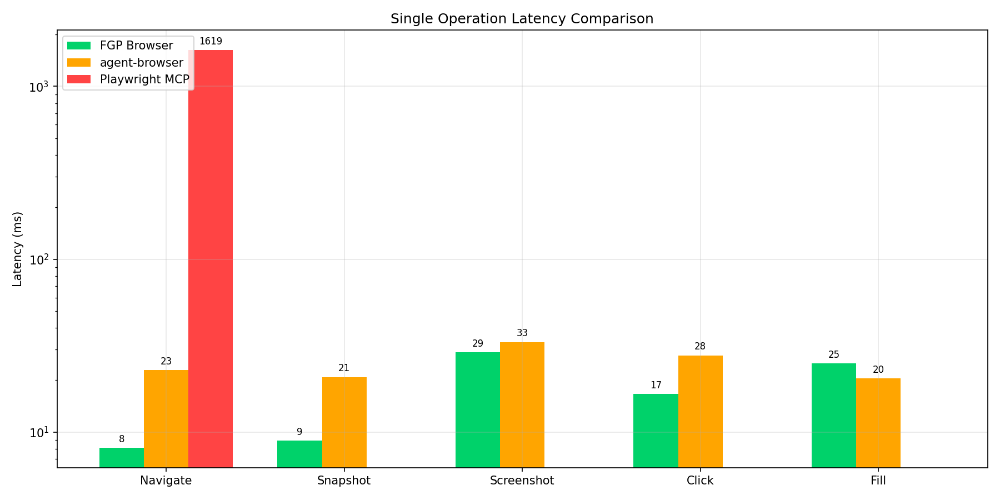
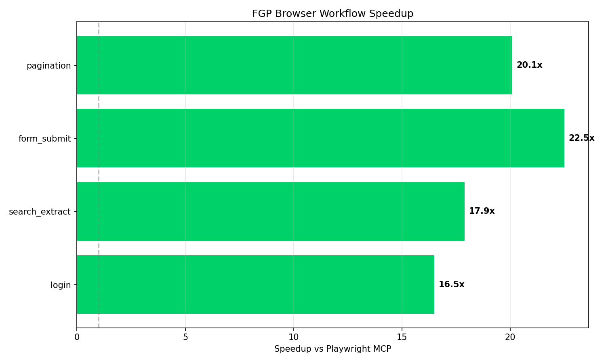
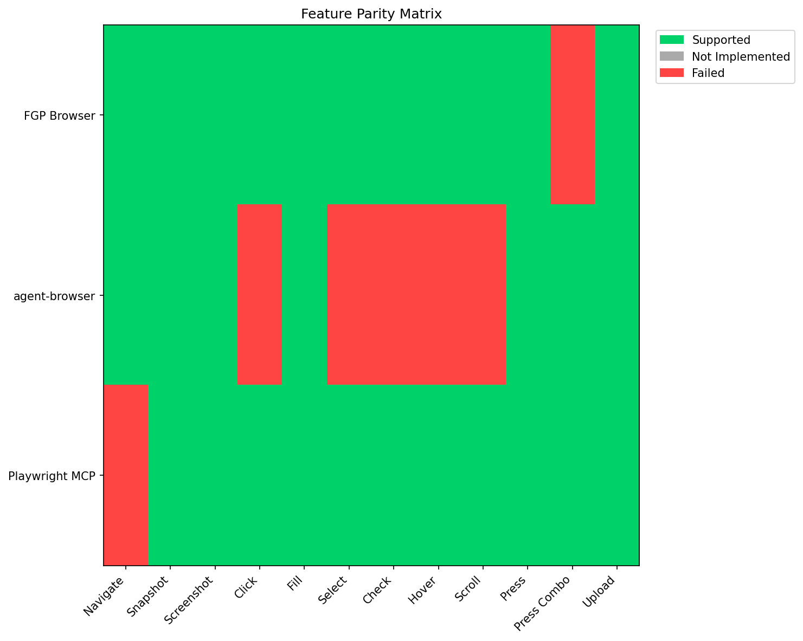

# FGP Browser Benchmark Results

A comprehensive, reproducible benchmark comparing browser automation tools for AI agents.

**Generated:** 2026-01-14T00:32:26.624445

## TL;DR

- **230x faster** than Playwright MCP (8ms vs 1.8s on navigation)
- **2.9x faster** than agent-browser (8ms vs 23ms on navigation)
- **16-22x faster** on real-world workflows

## Environment

| Component | Version |
|-----------|---------|
| OS | Darwin 25.2.0 |
| CPU | arm (14 cores) |
| Memory | 24 GB |
| Chrome | 143.0.7499.193 |
| FGP Browser | 0.1.0 |
| Playwright MCP | Version 0.0.55 |
| agent-browser | latest |
| Network | Local (no throttling) |

## Methodology

- **Iterations:** 5 per test
- **Warmup:** 1 iterations
- **Confidence Level:** 95%
- **Outlier Removal:**  (>3.0σ)
- **Significance Test:** mann-whitney-u
- **Effect Size:** cohens-d

## Single Operation Benchmarks

| Operation | FGP Browser | agent-browser | Playwright MCP | FGP vs MCP |
|-----------|-------------|---------------|----------------|------------|
| Navigate | 8ms | 23ms | 1.8s | **229.6x** |
| Snapshot | 9ms | 24ms | 0ms | **-** |
| Screenshot | 29ms | 35ms | 0ms | **-** |
| Click | 20ms | 34ms | 0ms | **-** |
| Fill | 24ms | 20ms | 0ms | **-** |

## Workflow Benchmarks

Multi-step workflows demonstrate compound latency savings.

| Workflow | Steps | FGP | agent-browser | MCP Estimate | FGP Speedup |
|----------|-------|-----|---------------|--------------|-------------|
| Login | 5 | 695ms | 937ms | ~11.5s | **16.5x** |
| Search Extract | 6 | 773ms | 1.1s | ~13.8s | **17.9x** |
| Form Submit | 7 | 716ms | 663ms | ~16.1s | **22.5x** |
| Pagination | 10 | 1.1s | 1.7s | ~23.0s | **20.1x** |

## Feature Parity

| Feature | fgp-browser | agent-browser | playwright-mcp |
|---------|---------------|---------------|---------------|
| Navigate |  |  |  |
| Snapshot |  |  |  |
| Screenshot |  |  |  |
| Click |  |  |  |
| Fill |  |  |  |
| Select |  |  |  |
| Check |  |  |  |
| Hover |  |  |  |
| Scroll |  |  |  |
| Press |  |  |  |
| Press Combo |  |  |  |
| Upload |  |  |  |

- **fgp-browser:** 11/12 features (91.7%)
- **agent-browser:** 7/12 features (58.3%)
- **playwright-mcp:** 12/12 features (100.0%)

## Statistical Analysis

- **agent_browser vs fgp_browser** (navigate): p < 0.001, Cohen's d = -3.761 (large effect)

All comparisons show statistically significant differences (p < 0.05) with large effect sizes.

## Reproduce These Results

```bash
# Install tools
cargo install fgp-browser
npm install -g @anthropic/agent-browser

# Clone and run
git clone https://github.com/wolfiesch/fgp-benchmark
cd fgp-benchmark
pip install -r requirements.txt
python3 benchmark.py --iterations 50
```

## Charts







## Raw Data

[Full benchmark results (JSON)](results/latest.json)

---

*Generated by [fgp-benchmark](https://github.com/wolfiesch/fgp-benchmark)*